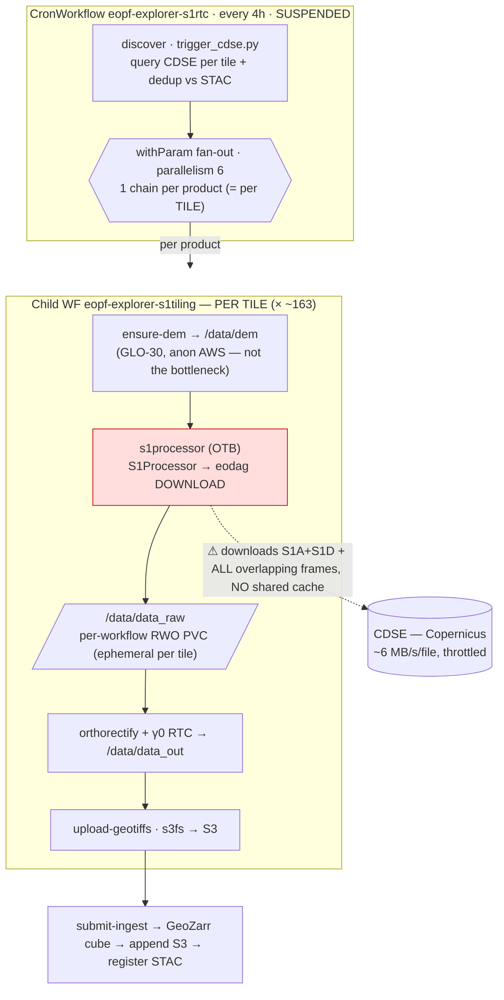
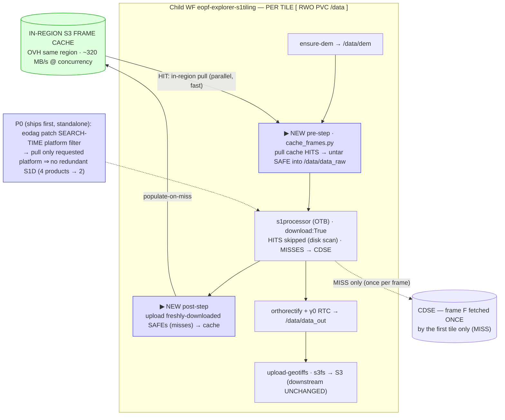

# Schematic: S1 RTC input-data caching — current vs planned

Supports `s1_input_data_caching.md` (spec) and `../plans/s1_input_data_caching.md` (plan).
Mermaid renders on GitHub / Obsidian; ASCII equivalents live in the spec/plan and the session notes.

## Current pipeline (per-tile fan-out · each tile re-downloads from CDSE)

**Redundancy:** one frame F (250×170 km) overlaps ~12 MGRS tiles ⇒ 12 independent workflows ⇒ F is
downloaded ~12× from CDSE ⇒ runs are download-bound (~35 min/run observed).

## Planned pipeline (P0 platform filter + P1 in-region S3 frame cache · download-once)

**Fleet effect:** frame F overlaps ~12 tiles → tile A (first) MISS→download-once→push to cache; tiles
B…L cache-HIT→in-region pull→local block (OTB at ~897 MB/s). CDSE egress for F: **12× → 1×** ⇒
compute-bound. OTB never reads through S3-FUSE (spike: 31 MB/s, wrong for random reads) — only fast
local block. DEM caching + RWX/Substrate-(ii) are explicitly out of scope for this plan.
